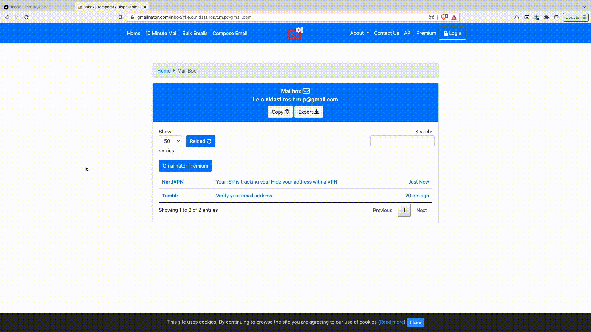

# Supabase + NextJS API (Authentication, CRUD API)

This is a simple todo application to explain the concept of Supbase integration with NextJS. It explain how to build Authentication and basic CRUD API with Supabase.

## Demo



## Environment Variables

To run this project, you will need to add the following environment variables to your .env file

`NEXT_PUBLIC_SUPABASE_URL`

`NEXT_PUBLIC_SUPABASE_ANON_KEY`

## Run Locally

Clone the project

```bash
  git clone git@github.com:ganeshmani/supabase-examples.git
```

Go to the project directory

```bash
  cd NextjsCRUD
```

Install dependencies

```bash
  npm install
```

Start the server

```bash
  npm run dev
```
